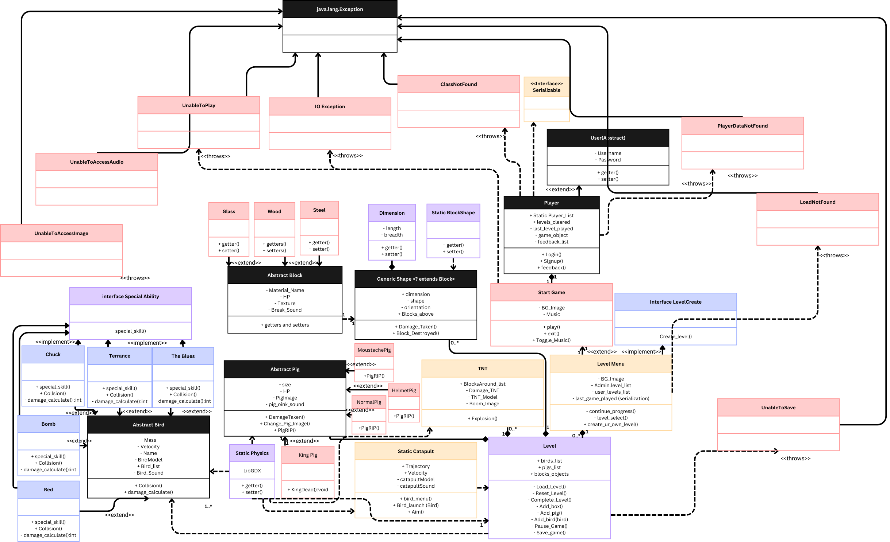
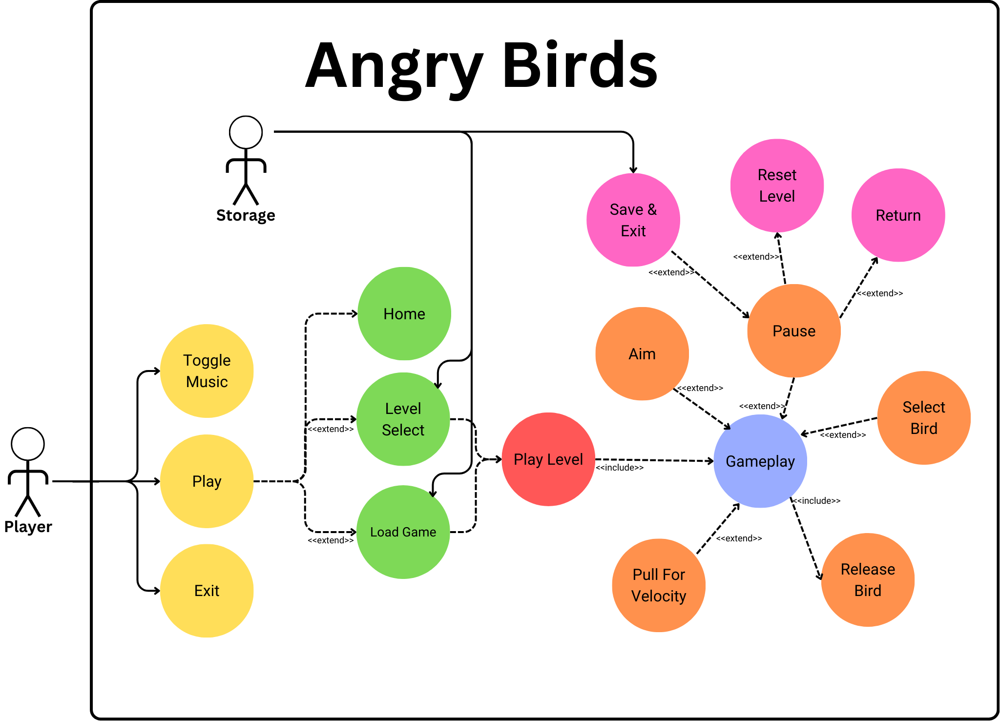

# Angry Birds Static GUI Prototype

## Contributors

- **Arhan Jain** - Roll No: 2023118, MakithAdrees
- **Nihal** - Roll No: 2023345, GolDRoger69

---

## Overview
- This repository contains fully functioning **Angry Birds**-like game developed using **LibGDX** in Java for **Advanced Programming Course CS201**.
- This is Last Deadline of the Project.
- The project includes fully functioning ***Angry Birds***. The buttons are functional for navigation between different screens, all the Levels are Working and all the Buttons are working as desired and implimented and all the Game Mechanics has been Implimented with Serialization for ***loading*** and ***Saving*** Game State.

## Structure
```game/
├── Main.java
├── Birds/
│   ├── Bird.java
│   ├── Blues.java
│   ├── Bomb.java
│   ├── Chuck.java
│   ├── Red.java
│   ├── SpecialAbility.java
│   └── Terrance.java
├── Blocks/
│   ├── Block.java
│   ├── Glass.java
│   ├── Stone.java
│   └── Wood.java
├── Extras/
│   ├── Catapult.java
├── Pigs/
│   ├── HelmetPig.java
│   ├── KingPig.java
│   ├── MoustachePig.java
│   ├── NormalPigs.java
│   └── Pig.java
└── Screen/
    ├── BirdSave.java
    ├── BlockSave.java
    ├── Level1Save.java
    ├── Level1.java
    ├── Level2.java
    ├── Level3.java
    ├── Level4.java
    ├── Levels.java
    ├── LoadLevel.java
    ├── PigSave.java
    ├── LoadingScreen.java
    ├── OptionsScreen.java
```

## Features
- `Screens`: Different game screens such as the Loading Screen, Main Screen, Options Screen, levsels, level1, level2, level3, level4, loadlevel Screens.
- `Buttons`: Interactive buttons with navigation functionality on Level Screen and levels.
- `Textures`: Custom textures for buttons and UI components, including modified circular buttons and all the textures are stored in assets folder in the Project **AngryBirds**.
- `Game functioning`: Proper Game functioning has been implimented, User can select which Bird they want to shoot by tapping on it and then to launch the bird, they have to drag it on the slinghsot and the 
                      trajectory of bird will be shown according to the stretch given to the bird on slingshot and then bird will be launched on that shown trajectory.
- `Bonus functioning`: Implimented an Random Level Generator, The Blocks in the different levels are Randomly Generated.
- `Serialization`: Implimented Serialization, There is a save button in levels whenever that button is clicked the state of that level is stored in the Json file of that level, and game state until that level is retained in another Json file. When game is Launched again on the Levels screen there is load button for levels whic shows load button of the levels which are saved and it also retains level cleared until that save.

## Screens Implemented
- `Loading Screen`: The starting point of the game with the is the Loading Screen with a loading Bar in the Bottom.
- `Play Screen`: This screen allows players to mute the game music and move to the level select screen.
- `Level Screen`: Select different levels from this screen and there is also a load button on this screen which can be used to load levels if there is any save state.
  ## ***Blocks are randomly generated from wood, Glass, Stone in all the Levels***
- `Level1`: Level 1 Screen with all the Elements and Textures and proper game and physical implementation.
- `Level2`: Level 2 Screen with all the Elements and Textures and proper game and physical implementation.
- `Level3`: Level 3 Screen with all the Elements and Textures and proper game and physical implementation.
- `Level4`: Level 4 Screen with all the Elements and Textures and proper game and physical implementation.


## Game Classes
Several classes and objects such as Catapult, birds, pigs, blocks, Levels classes have been declared as per the originally designed UML. <br>
Admin functionality, TNT, Login\Signup and MainScreen from the original UML has been removed. <br>

## Play Game
To start the game open the AngryBirds folder in some IDE, link the gradle of the root to the project and then follow the following path : <br>
`lwjl3 -> src -> main -> java -> com.angrybirds.game.lwjgl3 -> Lwjgl3Launcher` <br>
Proceed to launch the game by running the executable file. <br>
<br>
`Repository Link :` https://github.com/MakithAdrees/AngryBirds_AP.git <br>

## OOPS Conecepts
`Polymorphism :` Each bird class implements the special ability interface as part of bonus, which can be accessed while functionality is added to game <br>
`Inheritance :` Each bird extends Bird class, each pig extends Pig class, each block extends Block class <br>
`Abstraction :` The user class is abstract, which is extended by player and admin; The Bird class declares necessary attributes and methods, similarly abstract Pig <br>
`Generic :` Blocks<T> class takes three types of block textures Stone, wood, glass, which further implement the different shapes of these textures. <br>
`Encapsulation :` Methods and attributes have been declared private to classes and some volatile fields can be changed via getters and setters.<br>
`Association :` Classes such as catapult hold reference to bird objects. <br>
`Composition :` A level class can create and hold objects to many birds, pigs and blocks. <br>
`Static :` The Catapult class has been declared static, since at a single time only a single level is played and each level only requires one catapult. <br>

## UML




**Canva Link :** https://www.canva.com/design/DAGRUEwezGA/1OZeFpgAq9tISUAlCS0Qiw/edit?utm_content=DAGRUEwezGA&utm_campaign=designshare&utm_medium=link2&utm_source=sharebutton <br>